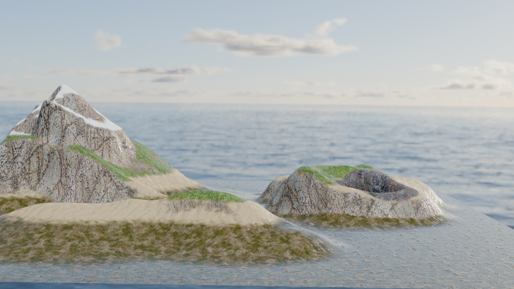
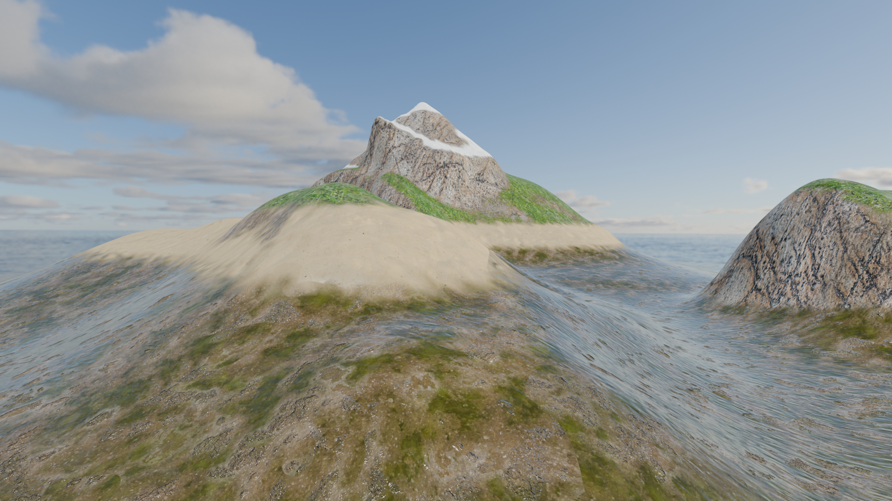
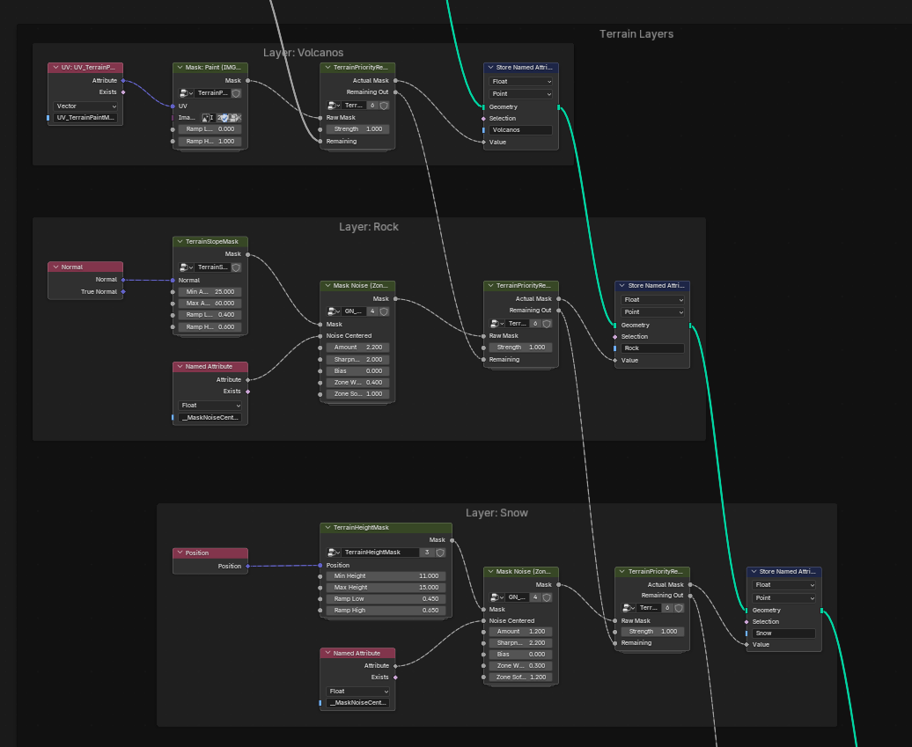
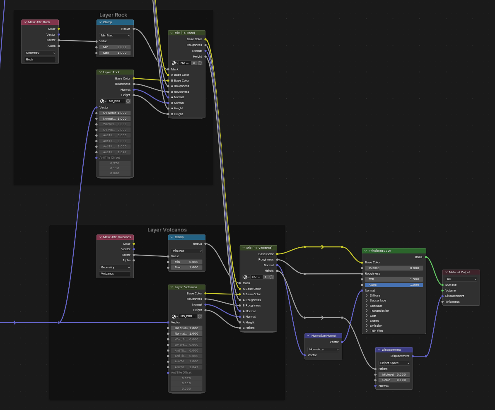

# Terrain Layers

A Blender addon to create and manage terrain layers. This python module allows to

- define and create terrain layers with different materials and properties in a python dictionary
- calculate masks for each layer based on height, slope, paint masks, path masks, and other factors defined in the configuration
- automatically generate a shader that blends the layers based on their masks

## Example Configuration

An example configuration for terrain layers is shown below. This configuration defines several layers such as "Underwater", "Beach", "Grass", "Snow", "Rock", and "Volcanos", each with its own properties and masks depending on height and slope.

<!-- Display demo images next to each other
-->
<div style="display: flex; gap: 10px;">
  
  
</div>

```python
config = TerrainConfig(
    geometry_modifier_name="Terrain_Layer_Masks",
    layers=[
        Layer(
            name="Underwater",
            priority=0,
            strength=1.0,
            ground_material=GroundMaterial(
                "Muddy ground with underwater moss",
                uv_scale=2.0,
                uv_warp=UVWarpConfig(),
                uv_anti_tiling=UVAntiTilingConfig(),
            ),
        ),
        Layer(
            name="Beach",
            priority=10,
            strength=1.0,
            mask=HeightMask(
                min_height=1.0,
                max_height=6.5,
                ramp_low=0.35,
                ramp_high=0.55,
            ),
            mask_noise=MaskNoiseConfig(
                dual=dual_default,
                amount=2.0,
                sharpness=1.6,
                bias=0.0,
                zone_width=0.35,
                zone_softness=1.0,
            ),
            ground_material=GroundMaterial("Sand"),
        ),
        Layer(
            name="Grass",
            priority=20,
            strength=1.0,
            mask=HeightMask(
                min_height=3.5,
                max_height=8.0,
                ramp_low=0.45,
                ramp_high=0.65,
            ),
            mask_noise=MaskNoiseConfig(
                dual=dual_default,  # reuses the same stored dual noise as Beach
                amount=1.8,
                sharpness=1.8,
                bias=0.0,
                zone_width=0.5,
                zone_softness=1.0,
            ),
            ground_material=GroundMaterial("Grass"),
        ),
        Layer(
            name="Snow",
            priority=25,
            strength=1.0,
            mask=HeightMask(
                min_height=11.0,
                max_height=15.0,
                ramp_low=0.45,
                ramp_high=0.65,
            ),
            mask_noise=MaskNoiseConfig(
                dual=dual_default,  # reuses default dual noise
                amount=1.2,
                sharpness=2.2,
                bias=0.0,
                zone_width=0.3,
                zone_softness=1.2,
            ),
            ground_material=GroundMaterial("Snow"),
        ),
        Layer(
            name="Rock",
            priority=27,
            strength=1.0,
            mask=SlopeMask(
                min_angle=25.0,
                max_angle=60.0,
                ramp_low=0.4,
                ramp_high=0.6,
            ),
            mask_noise=MaskNoiseConfig(
                dual=dual_alt,  # different dual noise => second stored attribute
                amount=2.2,
                sharpness=2.0,
                bias=0.0,
                zone_width=0.4,
                zone_softness=1.0,
            ),
            ground_material=GroundMaterial("Rock"),
        ),
        Layer(
            name="Volcanos",
            priority=30,
            strength=1.0,
            mask=PaintMask(
                image_name="IMG_Terrain_VolcanosMask",
            ),
            ground_material=GroundMaterial("04 Vulcanic Rock Surface D"),
        ),
        Layer(
            name="Roads",
            priority=40,
            strength=1.0,
            mask=RoadNetworkMask(
                path_settings=RoadPathSettings(
                    width=1.75,
                    falloff=1.25,
                    sample_count=256,
                ),
                paths=[
                    RoadNetworkPath(path_object_name="RoadPath"),
                    RoadNetworkPath(
                        path_collection_name="VillageRoads",
                        path_settings=RoadPathSettingsOverride(
                            width=2.5,
                            sample_count=384,
                        ),
                    ),
                ],
            ),
            ground_material=GroundMaterial("Dirt road"),
        ),
    ],
)
```

`RoadNetworkMask` is the road workflow. It can reference multiple Blender curve
objects and/or collections of curves, ray-project them onto the terrain, and
build one combined mask from their distances. Shared defaults live in
`path_settings`, and each object or collection can override them individually.

### Geometry Nodes

The script uses Geometry Nodes to calculate the masks for each terrain layer based on the configuration provided. It creates a modifier named "Terrain_Layer_Masks" (or the name specified in the configuration) that contains the necessary nodes to compute the masks.



### Shader

The addon automatically generates a shader that blends the different terrain layers based on their calculated masks. Each layer's ground material is combined using Mix Shader nodes, controlled by the respective mask attributes.



### Paths

You can create roads by adding curve objects to the scene and referencing them in a `RoadNetworkMask` layer. Each entry can point to either one curve object or one collection of curves. The addon samples those curves, projects them onto the terrain, and creates one combined road mask.

Note:

- Turn down `Levels_Preview` in the multires modifier settings when editing the curve, otherwise the ray projection will be very slow.
- To create a non-curved path, add a curve object, go into edit mode, select all vertices, and press S and then 0.
  - To undo this, select a vertex (it should be displayed as black), then click it again (it should turn white) to edit a tangent point.
- To join vertices at junctions
  - Create a new bezier curve, go into edit mode, press `Shift+A` and add the other bezier curve inside the existing object.
  - Select the vertices, press shift+s and "to active" to snap them together
  - Press `Ctrl+H` to create a hook modifier for that vertex

## Installation

- Clone the repository and install the python module as a Blender addon.
- See the `pipeline.py` file for an example of how to use the addon in the scripting window of Blender.

## Type Checking Setup

- Install Pylance
- install `fake-bpy-module` for stubs in a venv, select that interpreter in vscode
